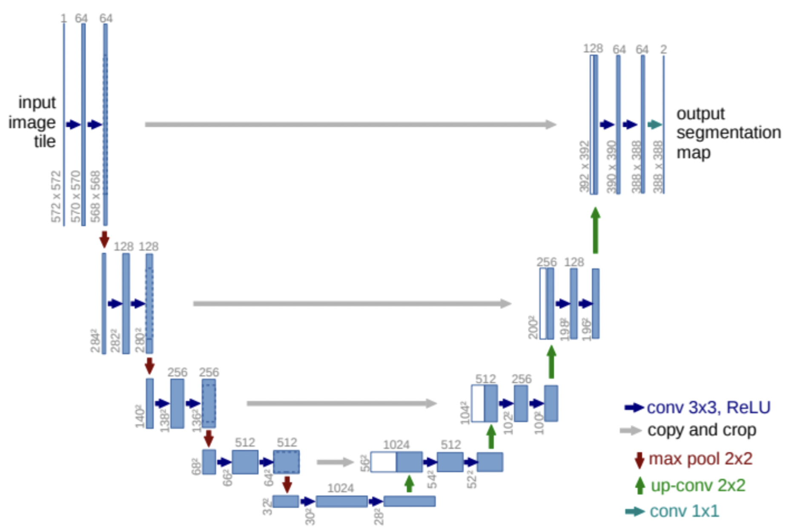
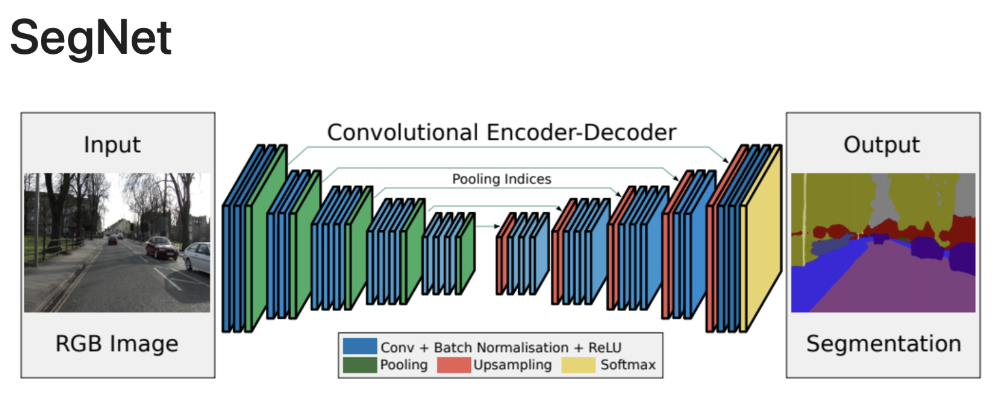
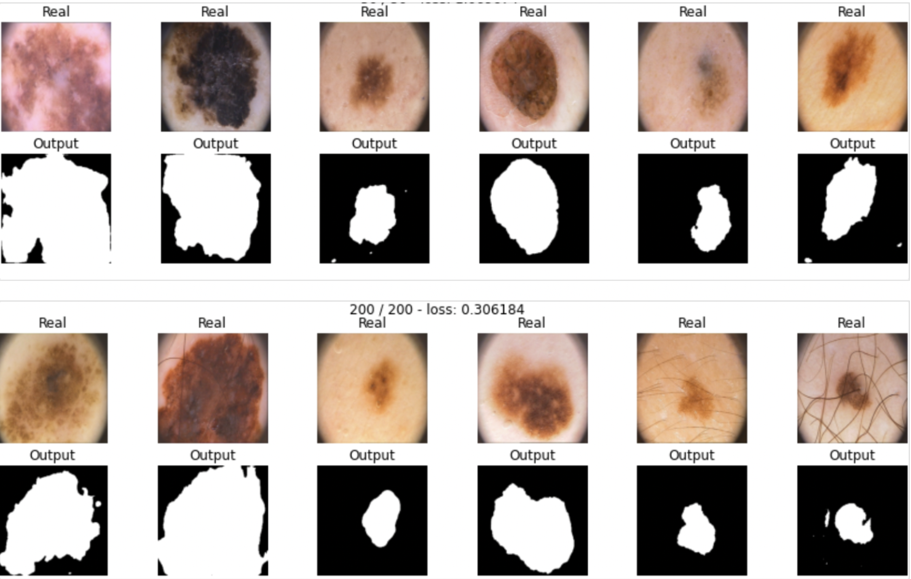

Deep Learning Project: Medical Image Segmentation. 

SegNet and U-Net architectures implemented with various loss functions: dice, bce, focal and hausdorff loss.

# U-Net architecture
The U-Net is an encoder-decoder neural network used for **semantic segmentation**.

# Seg-Net architecture

SegNet is fully convolutional neural network architecture for semantic pixel-wise segmentation 

# Processed images 

